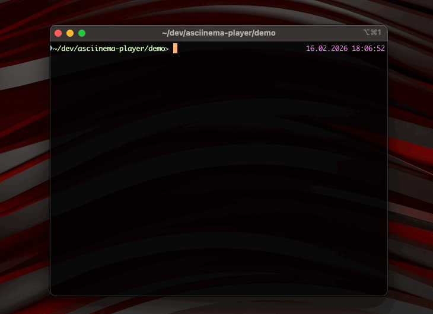
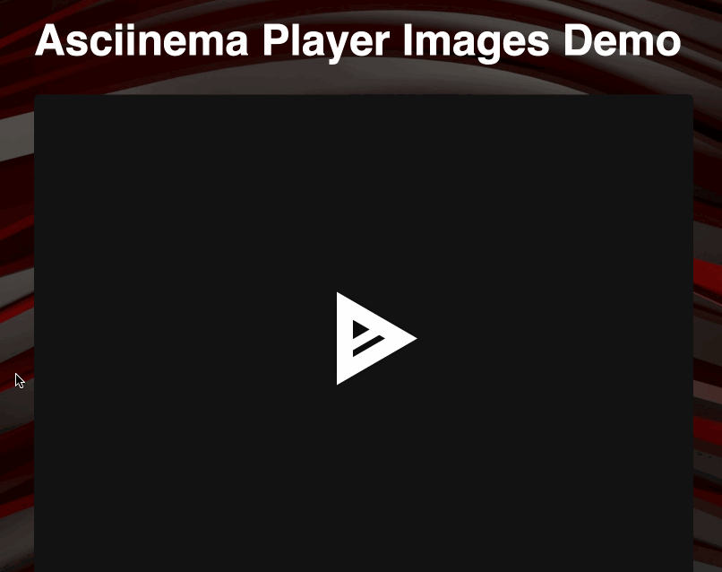

# Inline Image Support for asciinema-player

## Feature Description

This feature adds support for displaying inline images within terminal recordings played by asciinema-player. It implements the [iTerm2 Inline Images Protocol](https://iterm2.com/documentation-images.html) (OSC 1337), enabling terminal applications that emit inline images (such as Streamlit, matplotlib terminal backends, imgcat, etc.) to have their images rendered during playback.

### Protocol Support

Two variants of the iTerm2 inline image protocol are supported:

1. **Simple format** (single sequence):
   ```
   ESC ] 1337 ; File = [params] : <base64-data> BEL
   ```

2. **Multipart format** (chunked transfer):
   ```
   ESC ] 1337 ; MultipartFile = [params] BEL      (header)
   ESC ] 1337 ; FilePart = <base64-chunk> BEL      (one or more data chunks)
   ESC ] 1337 ; FileEnd BEL                        (end marker)
   ```

Supported parameters include `name` (base64-encoded filename), `size` (byte size), `width`/`height` (in cells, pixels, percent, or `auto`), `inline` (must be `1` for display), and `preserveaspectratio`.

### Supported Image Formats

Image format is auto-detected from the binary content (magic bytes), not from file extensions or MIME type parameters. The following formats are supported:

- **PNG**, **JPEG**, **GIF**, **WebP**, **BMP** — raster formats detected via magic bytes; PNG, GIF, and BMP also have their natural dimensions parsed from headers for aspect-ratio-correct sizing
- **SVG** — detected by looking for the `<svg` tag in the decoded content; natural dimensions are parsed from `width`/`height` attributes or `viewBox`
- **PDF** — detected via `%PDF` magic bytes (`0x25 0x50 0x44 0x46`); rendered to a PNG image using [pdf.js](https://mozilla.github.io/pdf.js/) (first page only, lazy-loaded from CDN)

### Future Protocol Support

This implementation concentrates on iTerm2 as the first supported protocol. The core pipeline (split-feed, scroll tracking, image store, overlay rendering) is protocol-agnostic, and the parser file is named `osc1337.js` to clearly scope it to one protocol. Support for additional inline image protocols could be added by creating new parser modules alongside it and wiring them into `interceptor.js`:

- **Kitty Graphics Protocol** — uses APC sequences (`ESC _ G ... ESC \`) with chunked transmission, image IDs, and a placement model. Currently these sequences pass through the OSC parser untouched and are silently ignored by the VT emulator. [Specification](https://sw.kovidgoyal.net/kitty/graphics-protocol/)
- **Sixel** — uses DCS sequences (`ESC P ... ESC \`) with a custom pixel encoding format (not base64). Currently these sequences also pass through untouched and are silently ignored by the VT. [Specification](https://vt100.net/docs/vt3xx-gp/chapter14.html)

### User-Visible Behavior

- Images appear at the cursor position where they were emitted in the original recording
- Images occupy a calculated number of terminal rows based on their dimensions
- As new terminal content is output, images scroll upward with the text
- Images that scroll completely off the top of the terminal viewport are removed
- Images partially scrolled off the top are clipped (not shrunk)
- Terminal reset (`\x1bc`) clears all images
- Seeking/rewinding in a recording properly re-renders images
- Images are rendered as an overlay on top of the terminal canvas, with `pointer-events: none` so they don't interfere with text selection

---

## Architecture Overview

The implementation spans 8 files across 3 layers: the Rust WASM virtual terminal, the JavaScript core pipeline, and the Solid.js rendering components.

```
Terminal Data Flow:

  recording data ──> ImageInterceptor.parse() ──> split into { images[], cleanedText }
                                                       │
                          ┌────────────────────────────┘
                          ▼
                    Core._feed() splits cleanedText at image boundaries
                          │
            ┌─────────────┼─────────────────────┐
            ▼             ▼                     ▼
     VT.feed(before)  VT.feed(\n*rows)    VT.feed(after)
     → scrolled: N    → scrolled: M       → scrolled: K
            │             │                     │
            └─────────────┼─────────────────────┘
                          ▼
                  ImageStore (positions adjusted by scroll counts)
                          │
                          ▼
                  ImageOverlay (Solid.js component, renders  elements)
```

---

## Changes by File

### 1. `src/vt/src/lib.rs` (Rust WASM Binding)

**Purpose**: Expose scroll count from the virtual terminal emulator to JavaScript.

**What changed**:
- Added a `FeedResult` struct with `lines: Vec<usize>` and `scrolled: usize` fields
- Modified `Vt::feed()` to return `FeedResult` instead of just the changed line indices
- The scroll count is obtained from `changes.scrollback.count()` — the number of lines garbage-collected from the scrollback buffer during the feed

**Why**: The core challenge of this feature is knowing exactly how many lines scrolled during each VT feed operation. The avt crate's `feed_str()` returns a `Changes` struct whose `scrollback` iterator yields lines evicted from the scrollback buffer. By setting `scrollback_limit(0)`, every scroll event immediately evicts a line, making `scrollback.count()` an exact scroll counter.

**Key code**:
```rust
#[derive(Serialize)]
struct FeedResult {
    lines: Vec<usize>,
    scrolled: usize,
}

pub fn feed(&mut self, s: &str) -> JsValue {
    let changes = self.vt.feed_str(s);
    let scrolled = changes.scrollback.count();
    serde_wasm_bindgen::to_value(&FeedResult {
        lines: changes.lines,
        scrolled,
    }).unwrap()
}
```

**Compatibility note**: All existing callers that use `result.lines` continue to work because `FeedResult` is a superset of the old return shape. The `scrolled` field is simply ignored by code that doesn't need it.

---

### 2. `src/core.js` (Feed Pipeline)

**Purpose**: Orchestrate image extraction, split-feed at image boundaries, scroll tracking, and image lifecycle management.

**What changed**:
- Added imports for `ImageStore` and `ImageInterceptor` with `calculateImageRows`
- Changed `scrollback_limit` from `100` to `0` in `_initializeVt()` to enable exact scroll counting
- Completely rewrote `_feed()` with two paths:
  - **Fast path** (no images in feed): feeds directly to VT, uses `result.scrolled` to shift existing images
  - **Image path**: splits the cleaned text at each image boundary, feeds segments individually, captures cursor position for each image, feeds placeholder newlines to reserve space, tracks cumulative scroll
- Added `_scrollImages(scrollAmount)` helper that shifts all stored image positions upward and removes images that have scrolled completely off-screen
- Added `getAllImages()` and `getImageBlobUrl(id)` as public API methods
- Simplified `_initializeVt()` to create `ImageInterceptor` without dependencies on cursor/terminal-size callbacks
- Added image store clearing on terminal reset (`\x1bc`) and VT reset

**The split-feed approach in detail**:

When a feed contains images, the pipeline:
1. Parses the data to extract images and their text positions
2. Sorts images by their position in the text
3. For each image:
   a. Feeds the text *before* the image to the VT → tracks any scroll
   b. Reads the VT cursor position → this is the image's initial viewport row/col
   c. Feeds `\n` × `displayRows` to advance the cursor past the image area → tracks scroll
   d. Adjusts the image row by subtracting the scroll from step (c)
   e. Stores the image with its adjusted position
4. Feeds any remaining text after the last image → tracks scroll

This approach is reliable because it uses the VT's own scroll tracking rather than trying to predict scrolling externally.

---

### 3. `src/image/osc1337.js` (OSC 1337 Parser) — New File

**Purpose**: Parse iTerm2 OSC 1337 inline image sequences from terminal data. Named to clearly scope it to a single protocol, leaving room for future `kitty.js` and `sixel.js` parsers alongside it.

**Key capabilities**:
- Handles both simple `File=` and multipart `MultipartFile`/`FilePart`/`FileEnd` protocols
- Maintains state across multiple `parse()` calls (buffering incomplete sequences)
- Extracts and returns `{ images[], cleanedText }` where `cleanedText` has image-related OSC 1337 sequences removed but all other OSC sequences (e.g., `OSC 4` for color palette, `OSC 0/1/2` for window title) are preserved and passed through to the VT emulator
- Each image includes: base64 data, MIME type (auto-detected from magic bytes), name, dimensions (width/height with type: cells/px/percent/auto), natural dimensions (read from image headers for PNG/GIF/BMP), and `preserveAspectRatio` flag
- `textPosition` on each image marks where in the cleaned text the image was located
- Supports OSC terminators: BEL (`\x07`), ST (`ESC \`), and chained OSC sequences

**Helper functions** (exported):
- `parseDimension(value)` — Parses iTerm2 dimension strings (`"100px"`, `"50%"`, `"10"` cells, `"auto"`)
- `getImageDimensions(base64Data)` — Reads natural width/height from PNG, GIF, BMP, and SVG headers
- `inferMimeType(base64Data)` — Detects image format from magic bytes (PNG, JPEG, GIF, WebP, BMP, SVG, PDF)

---

### 4. `src/image/interceptor.js` (Parser Wrapper) — New File

**Purpose**: Protocol-agnostic coordinator that wraps `OSC1337Parser` (and would wrap future Kitty/Sixel parsers) and provides the `calculateImageRows()` function.

**`calculateImageRows(imageData, terminalCols)`**:

Determines how many terminal rows an image should occupy based on its dimension parameters and the terminal width. Uses hardcoded character dimensions (`CHAR_WIDTH_PX=9`, `CHAR_HEIGHT_PX=20`) as reasonable defaults for calculating pixel-to-row conversion. The priority order for determining display height:

1. Explicit height in cells → use directly
2. Explicit height in pixels → convert to rows
3. Natural dimensions + aspect ratio → compute from display width
4. Natural height only → use directly
5. Fallback → `displayWidth * 0.75`

Display width follows a similar priority: explicit width (px/cells/percent) → natural width (capped to terminal width) → full terminal width.

---

### 5. `src/image/pdf.js` (PDF Renderer) — New File

**Purpose**: Lazy-loaded module that renders PDF page 1 to a PNG image using pdf.js.

**Key features**:
- Loads pdf.js (worker + main library) from CDN on first use — no npm dependency or consumer configuration required
- Renders page 1 at 2x scale to a `<canvas>`, converts to a PNG blob URL
- Returns `{ blobUrl, naturalWidth, naturalHeight }` for integration with the existing image pipeline
- Singleton pattern ensures pdf.js is loaded only once across multiple PDF images

**CDN loading**: Uses `https://cdn.jsdelivr.net/npm/pdfjs-dist@5.4.624/build/` for both `pdf.mjs` and `pdf.worker.mjs`. The worker module is imported first to register `globalThis.pdfjsWorker`, enabling main-thread processing without a Web Worker.

---

### 6. `src/image/store.js` (Image Storage) — New File

**Purpose**: Manage image data, lifecycle, and spatial indexing.

**Key features**:
- Stores images in a `Map<id, ImageData>` with auto-incrementing IDs
- Maintains a `lineImages` row-to-ID index for efficient spatial lookup
- Lazy blob URL creation via `getBlobUrl(id)` — converts base64 to blob only when first requested
- PDF handling: detects `application/pdf` MIME type, triggers async rendering via `renderPdfToImage()`, returns `null` while rendering is in progress, and invokes `onImageReady` callback when complete to trigger a re-render
- `updateRow(id, newRow)` — updates an image's row position (used during scrolling), maintaining the row index
- `remove(id)` — removes an image and revokes its blob URL to free memory
- `clear()` — removes all images and revokes all blob URLs
- `getAllImages()` — returns shallow copies of all images (important for Solid.js reactivity)

**Solid.js reactivity note**: `getAllImages()` returns `{ ...img }` shallow copies rather than the stored objects themselves. This is critical because Solid.js's `<For>` component tracks items by reference — mutating an object's `row` field in-place doesn't trigger a re-render, but returning a new object does.

---

### 7. `src/components/ImageOverlay.js` (Rendering) — New File

**Purpose**: Solid.js component that renders images as absolutely positioned `` elements overlaid on the terminal.

**Positioning**: Uses percentage-based CSS calculations relative to the terminal grid:
- `left: calc(100% * col / cols)` — horizontal position
- `top: calc(100% * row / rows)` — vertical position
- `height: calc(100% * displayRows / rows)` — image height
- `width: auto` with `max-width` constrained to available space

**Clipping**: When an image is partially scrolled off the top (negative row), a CSS `clip-path: inset(X% 0 0 0)` clips the top portion without resizing the image. The clip percentage is `(-row / displayRows) * 100`.

**Reactivity**: Uses a `createMemo` that depends on `props.imageUpdateSignal()` — a counter incremented by `Terminal.js` whenever images change (new images added, images scrolled, or images cleared).

---

### 8. `src/components/Terminal.js` (Terminal Component)

**Purpose**: Integrate the image overlay into the terminal render tree.

**What changed**:
- Added import of `ImageOverlay`
- Added `imageUpdateCounter` signal (incremented on image events)
- Extended `onVtUpdate` handler to detect image-related events (`newImages`, `imagesCleared`, `imagesScrolled`) and increment the counter
- Added `<ImageOverlay>` to the JSX render tree between the canvas and the SVG/text layers

---

### 9. `src/less/partials/_terminal.less` (CSS)

**Purpose**: Style the image overlay container and image elements.

**What changed**: Added `.ap-image-overlay` styles inside `div.ap-term`:
```less
.ap-image-overlay {
  position: absolute;
  inset: 0;
  overflow: hidden;
  pointer-events: none;
  z-index: 1;

  img {
    position: absolute;
  }
}
```

The overlay is absolutely positioned to fill the terminal area, with `overflow: hidden` to clip images at the terminal boundary, `pointer-events: none` so text selection works through images, and `z-index: 1` to render above the canvas but in the same stacking context as text.

---

## Key Design Decisions

### 1. Split-Feed vs. Newline Counting

**Problem**: Images need to be positioned at specific terminal rows, but the VT emulator handles scrolling internally. External newline counting is unreliable because it doesn't account for line wrapping, cursor movement sequences, or other scroll-triggering behavior.

**Solution**: Split the VT feed at image boundaries. Feed text in segments, querying the VT cursor and scroll count between each segment. This gives exact positions without trying to replicate the VT's internal logic.

**Trade-off**: Slightly more overhead per image (multiple VT feeds instead of one), but correctness is guaranteed.

### 2. scrollback_limit(0)

**Problem**: The avt crate's `scrollback` iterator yields garbage-collected lines, not per-scroll events. With a non-zero limit (e.g., the previous value of 100), the hard limit is `2*N` (200), and lines are only GC'd when the buffer exceeds that threshold — producing inaccurate, batched counts that can't be used for per-feed scroll tracking.

**Solution**: Set `scrollback_limit(0)` so every scroll immediately evicts a line, making `scrollback.count()` an exact per-feed scroll counter.

**Trade-off**: Disables the scrollback buffer. This is acceptable because:
1. The player has no scroll-up UI — users cannot access scrollback history, so the 100-line buffer was accumulating memory with no visible benefit.
2. All 28 existing Playwright tests pass without modification, confirming no user-visible behavior change for non-image recordings.
3. The only code that ever read from the scrollback buffer was the image scroll-tracking logic introduced by this feature.

**Future improvement**: The root cause is that avt (v0.16.0) doesn't expose a dedicated per-feed scroll counter — it only provides GC'd-lines-from-scrollback, which equals the scroll count only when `scrollback_limit(0)`. If avt were to add a `changes.scroll_count` field (or similar), the scrollback limit could be restored to any value while still getting accurate scroll counts for image positioning. Since avt is maintained by the same author, this would be a natural enhancement to propose alongside this feature.

### 3. Blob URLs (Lazy)

**Problem**: Images arrive as base64 strings which can't be used directly as `` efficiently.

**Solution**: Convert to blob URLs via `URL.createObjectURL()`, but only when first rendered (lazy creation). This avoids upfront conversion cost for images that might never be displayed (e.g., if the user seeks past them).

### 4. PDF Rendering via pdf.js (CDN, Lazy-Loaded)

**Problem**: PDFs arrive through the same OSC 1337 protocol as images, but browsers can't render PDF bytes directly in `` tags. Bundling pdf.js (~400KB+ for worker alone) would bloat the player for the majority of users who never encounter PDFs.

**Solution**: Render PDF page 1 to a `<canvas>`, convert to a PNG blob URL, and feed it into the existing `` pipeline. pdf.js is loaded from CDN via dynamic `import()` only when a PDF is first encountered — zero impact on bundle size or load time for the common case.

**Async handling**: Since pdf.js rendering is async but `getBlobUrl()` is called synchronously from the render loop, `getBlobUrl()` returns `null` on first call for PDFs and fires off the async render. When rendering completes, an `onImageReady` callback dispatches a `vtUpdate` event, causing `ImageOverlay` to re-render and pick up the now-available blob URL.

### 5. Image Sizing: Measured Cell Dimensions

**Problem**: Images that specify dimensions in pixels or rely on natural dimensions need to be converted to terminal rows. The original implementation used hardcoded character dimensions (`CHAR_WIDTH_PX=9`, `CHAR_HEIGHT_PX=20`) for this conversion, which may not match the actual rendered cell size — causing images to appear larger or smaller than they do in the recording terminal (e.g. iTerm2).

**Solution**: `calculateImageRows()` now accepts optional `charW`/`charH` parameters for the actual cell pixel dimensions. After the terminal is mounted, `view.js` calls `core.setCharMetrics(charW, charH)` with the measured values from `measureTerminal()`. The hardcoded values remain as fallbacks for cases where metrics aren't available (e.g. the WebWorker split build, or poster rendering before mount).

**Current limitation**: The player's default font settings (15px font, 1.333 line-height) produce a cell height of ~20px — coincidentally matching the old hardcoded default. So with default settings, the measured metrics produce the same result as the constants. The fix has a visible effect when custom `terminalFontFamily`, `terminalFontSize`, or `terminalLineHeight` options are used.

**Remaining discrepancy with the CLI**: Even with measured cell dimensions, images may appear slightly different in the player vs. the original terminal because the player uses its own cell proportions, not the recording terminal's. For example, if the recording was made in iTerm2 with a 14px font (cell height ~18px) but the player renders with 20px cells, images will occupy fewer rows and appear smaller relative to text. The only way to fully resolve this is for the asciicast format to include the recording terminal's cell dimensions (e.g. `cellWidth`/`cellHeight` in the header). The `TIOCGWINSZ` ioctl that the recorder already uses to get cols/rows also returns pixel dimensions, so this would be a minimal change to the recorder. The player would then use those values instead of its own measurements.

**Visual comparison** — the same recording played in the CLI (`asciinema play`) vs. the browser player:

| asciinema CLI | asciinema-player |
|---|---|
|  |  |

### 6. CSS clip-path for Partial Scrolling

**Problem**: When an image scrolls partially off the top, reducing its CSS height causes the image to shrink rather than clip.

**Solution**: Keep the `` element at its full size and position, and use `clip-path: inset(X% 0 0 0)` to hide the scrolled-off portion. This maintains the image's visual integrity while correctly clipping.

---

## Testing

### Test Recordings

`demo.cast` — An asciicast recording containing 2 inline images using the MultipartFile protocol. The images are 200x200 PNG files that each occupy approximately 10 terminal rows.

`tests/assets/images-iterm2.cast` — An asciicast recording exercising all 7 supported image formats (PNG, JPEG, WebP, BMP, GIF, SVG, PDF), each displayed at `height=3` cells. Used by the Playwright test suite to verify that inline images render correctly.

### Automated Tests

The Playwright test `"renders inline images from iTerm2 OSC 1337 sequences"` in `tests/player.spec.js` verifies:
- Terminal text labels are visible (OSC 1337 sequences are properly stripped)
- At least 6 `` elements appear in the `.ap-image-overlay` (all formats except PDF, which depends on CDN availability)
- All rendered images use `blob:` URLs

### Manual Verification Checklist

1. Images appear at the correct positions (not overlapping text)
2. Images scroll with content as the recording plays
3. Images that scroll off the top disappear cleanly
4. Images partially off-screen are clipped, not shrunk
5. Seeking/rewinding in the recording correctly re-places images
6. Terminal reset (`\x1bc`) clears all images
7. Text selection works through/around images (pointer-events: none)
8. No memory leaks (blob URLs are revoked on image removal)
9. PDF images render correctly (first page displayed as PNG)
10. PDF rendering does not block the UI (async with placeholder)
